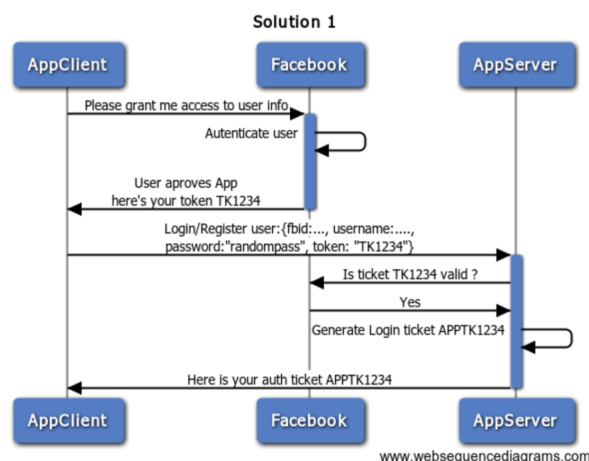

## Redux Login Page

### Specs
  - Use Redux to manage state
  - Use OAUTH2 to grant a user access to a protected page
  - mock a OAuth server that sends the access token
  - use Grommet library for the Carousel

### OAuth2 Flow
  

### Libraries for styling (CSS + Effects)
- Carousel from [Grommet](https://grommet.io/docs/carousel)
- Buttons from [Material UI](https://material-ui.com/demos/buttons/)

### Libraries for manipulating form data
- [Redux Form](https://redux-form.com/7.4.2/examples/material-ui/)
- [Redux Formik](https://codesandbox.io/s/z65oq5q9y3) 🔥

### Libraries for making ajax requests
- [axios](https://github.com/axios/axios)
- [redux-saga](https://github.com/redux-saga/redux-saga)
